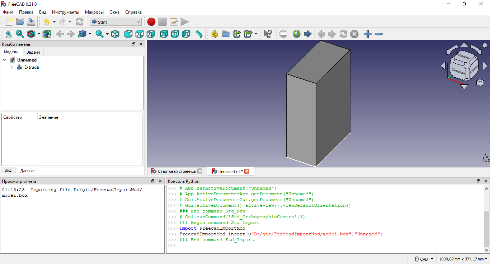

# FreecadImportMod

Short example of [FreeCAD](https://www.freecad.org/index.php) importing plugin.

The plugin creates a box model with `width`, `height`, and `depth` properties that are defined in a `*.box` file.



## Getting started

1. Copy the project folder into the FreeCAD ["Mod" dir](https://wiki.freecad.org/Workbench_creation) (On Windows it is `%APPDATA%\FreeCAD\Mod\`, which is usually `C:\Users\<username>\Appdata\Roaming\FreeCAD\Mod\`).
    ```
    /Mod/
     +-- FreecadImportMod/
         +-- Init.py
         +-- InitGui.py
         +-- FreecadImportMod.py
    ```
2. Run FreeCAD.
3. Create a new project (CTRL+N).
4. Import the `model.box` file (CTRL+I).
